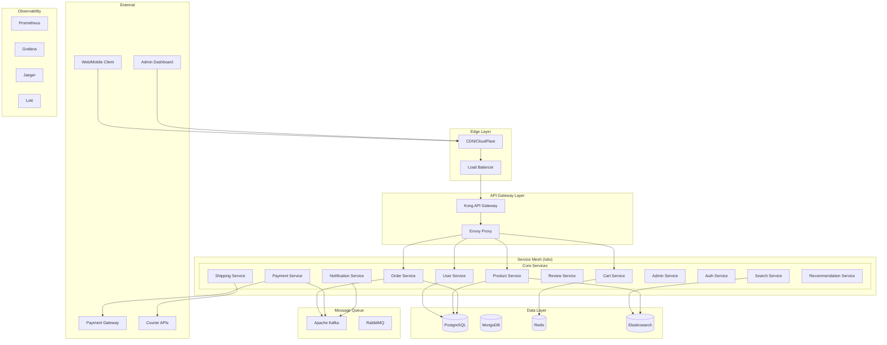
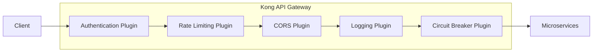
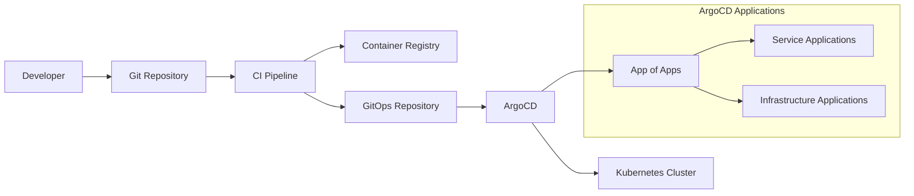

# ShopSphere eCommerce Platform Design Document

## Overview

ShopSphere is a cloud-native, microservices-based eCommerce platform designed for enterprise-scale operations. The platform leverages modern DevOps practices, Kubernetes orchestration, service mesh architecture, and comprehensive observability to deliver a resilient, scalable, and maintainable solution.

The system follows Domain-Driven Design (DDD) principles with clear service boundaries, implements event-driven architecture for loose coupling, and uses GitOps for deployment management. The platform supports the complete customer journey from product discovery to order fulfillment while providing administrative capabilities for business operations.

## Architecture

### High-Level Architecture



### Microservices Architecture

The platform consists of 12 core microservices, each with specific domain responsibilities:

1. **User Service**: User registration, authentication, profile management
2. **Product Service**: Product catalog, inventory management, categories
3. **Cart Service**: Shopping cart operations, session management
4. **Order Service**: Order processing, status management, order history
5. **Payment Service**: Payment processing, refunds, payment methods
6. **Shipping Service**: Shipping calculations, tracking, delivery management
7. **Review Service**: Product reviews, ratings, moderation
8. **Notification Service**: Email, SMS, push notifications
9. **Admin Service**: Administrative operations, reporting, analytics
10. **Auth Service**: JWT token management, authorization
11. **Search Service**: Full-text search, filtering, recommendations
12. **Recommendation Service**: ML-based product recommendations

### Technology Stack

| Component | Technology | Rationale |
|-----------|------------|-----------|
| **Backend Services** | Go/Node.js | High performance, excellent concurrency support |
| **Frontend** | React/Next.js | Modern SPA with SSR capabilities |
| **API Gateway** | Kong/Envoy | Advanced traffic management and security |
| **Service Mesh** | Istio | Comprehensive observability and security |
| **Container Runtime** | Docker | Standardized containerization |
| **Orchestration** | Kubernetes | Industry-standard container orchestration |
| **Primary Database** | PostgreSQL | ACID compliance, complex queries |
| **Document Store** | MongoDB | Flexible schema for product catalogs |
| **Cache/Session** | Redis | High-performance caching and sessions |
| **Search Engine** | Elasticsearch | Full-text search and analytics |
| **Message Queue** | Apache Kafka | High-throughput event streaming |
| **Monitoring** | Prometheus + Grafana | Metrics collection and visualization |
| **Tracing** | Jaeger + OpenTelemetry | Distributed tracing |
| **Logging** | Loki + Fluentd | Centralized log aggregation |
| **GitOps** | ArgoCD | Declarative deployment management |
| **CI/CD** | GitHub Actions | Automated build and deployment |
| **Infrastructure** | Terraform | Infrastructure as Code |

## Components and Interfaces

### Service Communication Patterns

#### Synchronous Communication
- **REST APIs**: Primary interface for client-service communication
- **gRPC**: High-performance inter-service communication
- **GraphQL**: Flexible data fetching for frontend applications

#### Asynchronous Communication
- **Event Streaming**: Kafka for high-throughput event processing
- **Message Queues**: RabbitMQ for reliable message delivery
- **Pub/Sub**: Redis for real-time notifications

### API Gateway Design



**Kong Configuration Features:**
- JWT authentication with Auth Service integration
- Rate limiting per client/endpoint (100 req/min default)
- Circuit breaker with 50% failure threshold
- Request/response transformation
- API versioning support
- Health check endpoints

### Service Mesh Configuration

**Istio Service Mesh Features:**
- Automatic mTLS between services
- Traffic management with virtual services
- Fault injection for chaos engineering
- Distributed tracing with Jaeger integration
- Metrics collection via Prometheus
- Security policies with authorization rules

### Database Design Strategy

#### PostgreSQL (Primary Database)
- **Users**: User accounts, profiles, authentication data
- **Orders**: Order details, status, payment information
- **Products**: Core product information, inventory
- **Reviews**: Product reviews and ratings

#### MongoDB (Document Store)
- **Product Catalog**: Rich product descriptions, media, variants
- **User Preferences**: Personalization data, recommendations
- **Analytics**: User behavior, clickstream data

#### Redis (Cache & Sessions)
- **Session Store**: User sessions, cart data
- **Cache Layer**: Frequently accessed data
- **Real-time Data**: Live inventory, pricing

#### Elasticsearch (Search & Analytics)
- **Product Search**: Full-text search, faceted search
- **Analytics**: Business intelligence, reporting
- **Log Analysis**: Application and system logs

## Data Models

### Core Domain Models

#### User Domain
```go
type User struct {
    ID          string    `json:"id" db:"id"`
    Email       string    `json:"email" db:"email"`
    Username    string    `json:"username" db:"username"`
    PasswordHash string   `json:"-" db:"password_hash"`
    FirstName   string    `json:"first_name" db:"first_name"`
    LastName    string    `json:"last_name" db:"last_name"`
    Phone       string    `json:"phone" db:"phone"`
    Role        UserRole  `json:"role" db:"role"`
    Status      UserStatus `json:"status" db:"status"`
    CreatedAt   time.Time `json:"created_at" db:"created_at"`
    UpdatedAt   time.Time `json:"updated_at" db:"updated_at"`
}

type UserRole string
const (
    RoleCustomer UserRole = "customer"
    RoleAdmin    UserRole = "admin"
    RoleModerator UserRole = "moderator"
)
```

#### Product Domain
```go
type Product struct {
    ID          string      `json:"id" db:"id"`
    SKU         string      `json:"sku" db:"sku"`
    Name        string      `json:"name" db:"name"`
    Description string      `json:"description" db:"description"`
    CategoryID  string      `json:"category_id" db:"category_id"`
    Price       decimal.Decimal `json:"price" db:"price"`
    Currency    string      `json:"currency" db:"currency"`
    Stock       int         `json:"stock" db:"stock"`
    Status      ProductStatus `json:"status" db:"status"`
    Images      []string    `json:"images" db:"images"`
    Attributes  ProductAttributes `json:"attributes" db:"attributes"`
    CreatedAt   time.Time   `json:"created_at" db:"created_at"`
    UpdatedAt   time.Time   `json:"updated_at" db:"updated_at"`
}

type ProductAttributes struct {
    Brand       string            `json:"brand"`
    Color       string            `json:"color"`
    Size        string            `json:"size"`
    Weight      float64           `json:"weight"`
    Dimensions  Dimensions        `json:"dimensions"`
    Custom      map[string]interface{} `json:"custom"`
}
```

#### Order Domain
```go
type Order struct {
    ID              string          `json:"id" db:"id"`
    UserID          string          `json:"user_id" db:"user_id"`
    Status          OrderStatus     `json:"status" db:"status"`
    Items           []OrderItem     `json:"items"`
    Subtotal        decimal.Decimal `json:"subtotal" db:"subtotal"`
    Tax             decimal.Decimal `json:"tax" db:"tax"`
    Shipping        decimal.Decimal `json:"shipping" db:"shipping"`
    Total           decimal.Decimal `json:"total" db:"total"`
    Currency        string          `json:"currency" db:"currency"`
    ShippingAddress Address         `json:"shipping_address"`
    BillingAddress  Address         `json:"billing_address"`
    PaymentMethod   PaymentMethod   `json:"payment_method"`
    CreatedAt       time.Time       `json:"created_at" db:"created_at"`
    UpdatedAt       time.Time       `json:"updated_at" db:"updated_at"`
}

type OrderStatus string
const (
    OrderPending    OrderStatus = "pending"
    OrderConfirmed  OrderStatus = "confirmed"
    OrderProcessing OrderStatus = "processing"
    OrderShipped    OrderStatus = "shipped"
    OrderDelivered  OrderStatus = "delivered"
    OrderCancelled  OrderStatus = "cancelled"
    OrderRefunded   OrderStatus = "refunded"
)
```

### Event Schema Design

#### Domain Events
```go
type OrderCreatedEvent struct {
    EventID     string    `json:"event_id"`
    EventType   string    `json:"event_type"`
    AggregateID string    `json:"aggregate_id"`
    Version     int       `json:"version"`
    Timestamp   time.Time `json:"timestamp"`
    Data        OrderCreatedData `json:"data"`
}

type OrderCreatedData struct {
    OrderID    string          `json:"order_id"`
    UserID     string          `json:"user_id"`
    Items      []OrderItem     `json:"items"`
    Total      decimal.Decimal `json:"total"`
    Currency   string          `json:"currency"`
}
```

## Error Handling

### Error Response Standards

All services implement consistent error handling with standardized error responses:

```go
type ErrorResponse struct {
    Error   ErrorDetail `json:"error"`
    TraceID string      `json:"trace_id"`
}

type ErrorDetail struct {
    Code    string `json:"code"`
    Message string `json:"message"`
    Details string `json:"details,omitempty"`
}
```

### Error Categories

1. **Client Errors (4xx)**
   - `VALIDATION_ERROR`: Input validation failures
   - `AUTHENTICATION_ERROR`: Authentication failures
   - `AUTHORIZATION_ERROR`: Permission denied
   - `NOT_FOUND`: Resource not found
   - `CONFLICT`: Resource conflict (duplicate, constraint violation)

2. **Server Errors (5xx)**
   - `INTERNAL_ERROR`: Unexpected server errors
   - `SERVICE_UNAVAILABLE`: Downstream service failures
   - `TIMEOUT_ERROR`: Request timeout
   - `DATABASE_ERROR`: Database operation failures

### Circuit Breaker Implementation

Services implement circuit breakers using the Hystrix pattern:

```go
type CircuitBreakerConfig struct {
    Timeout               time.Duration
    MaxConcurrentRequests int
    RequestVolumeThreshold int
    SleepWindow           time.Duration
    ErrorPercentThreshold int
}
```

**Default Configuration:**
- Timeout: 5 seconds
- Max Concurrent Requests: 100
- Request Volume Threshold: 20
- Sleep Window: 30 seconds
- Error Percent Threshold: 50%

### Retry Policies

Exponential backoff with jitter for transient failures:

```go
type RetryConfig struct {
    MaxRetries      int
    InitialInterval time.Duration
    MaxInterval     time.Duration
    Multiplier      float64
    Jitter          bool
}
```

## Testing Strategy

### Testing Pyramid

#### Unit Tests (70%)
- Service logic testing
- Domain model validation
- Utility function testing
- Mock external dependencies
- Target: >90% code coverage

#### Integration Tests (20%)
- Database integration
- Message queue integration
- External API integration
- Service-to-service communication
- Contract testing with Pact

#### End-to-End Tests (10%)
- Complete user journeys
- Cross-service workflows
- UI automation with Cypress
- Performance validation
- Chaos engineering tests

### Test Data Management

```yaml
# Test Data Strategy
test_data:
  unit_tests:
    approach: "In-memory fixtures"
    tools: ["testify", "gomock"]
  
  integration_tests:
    approach: "Test containers"
    tools: ["testcontainers", "docker-compose"]
  
  e2e_tests:
    approach: "Dedicated test environment"
    tools: ["k6", "cypress", "newman"]
```

### Performance Testing

#### Load Testing with k6
```javascript
// k6 load test configuration
export let options = {
  stages: [
    { duration: '2m', target: 100 },   // Ramp up
    { duration: '5m', target: 100 },   // Stay at 100 users
    { duration: '2m', target: 200 },   // Ramp up to 200
    { duration: '5m', target: 200 },   // Stay at 200 users
    { duration: '2m', target: 0 },     // Ramp down
  ],
  thresholds: {
    http_req_duration: ['p(95)<500'],  // 95% of requests under 500ms
    http_req_failed: ['rate<0.1'],     // Error rate under 10%
  },
};
```

#### Performance SLIs/SLOs
- **Availability**: 99.9% uptime
- **Latency**: P95 < 500ms, P99 < 1000ms
- **Throughput**: 1000 RPS per service
- **Error Rate**: < 0.1% for critical paths

## Deployment Architecture

### Kubernetes Cluster Design

```yaml
# Cluster Configuration
cluster:
  node_pools:
    - name: "system"
      machine_type: "n1-standard-2"
      min_nodes: 3
      max_nodes: 5
      taints:
        - key: "node-type"
          value: "system"
          effect: "NoSchedule"
    
    - name: "application"
      machine_type: "n1-standard-4"
      min_nodes: 5
      max_nodes: 20
      auto_scaling: true
    
    - name: "data"
      machine_type: "n1-highmem-4"
      min_nodes: 3
      max_nodes: 6
      taints:
        - key: "node-type"
          value: "data"
          effect: "NoSchedule"
```

### Helm Chart Structure

```
charts/
├── shopsphere-platform/          # Umbrella chart
│   ├── Chart.yaml
│   ├── values.yaml
│   └── charts/
│       ├── user-service/
│       ├── product-service/
│       ├── order-service/
│       └── ...
├── infrastructure/               # Infrastructure components
│   ├── istio/
│   ├── prometheus/
│   ├── grafana/
│   └── argocd/
└── environments/                # Environment-specific values
    ├── dev/
    ├── staging/
    └── production/
```

### GitOps Workflow with ArgoCD



### Canary Deployment with Argo Rollouts

```yaml
# Argo Rollouts Configuration
apiVersion: argoproj.io/v1alpha1
kind: Rollout
metadata:
  name: user-service
spec:
  replicas: 10
  strategy:
    canary:
      steps:
      - setWeight: 10
      - pause: {duration: 2m}
      - setWeight: 20
      - pause: {duration: 2m}
      - setWeight: 50
      - pause: {duration: 2m}
      - setWeight: 100
      analysis:
        templates:
        - templateName: success-rate
        args:
        - name: service-name
          value: user-service
      trafficRouting:
        istio:
          virtualService:
            name: user-service-vs
```

### Auto-scaling Configuration

#### HPA Configuration
```yaml
apiVersion: autoscaling/v2
kind: HorizontalPodAutoscaler
metadata:
  name: user-service-hpa
spec:
  scaleTargetRef:
    apiVersion: apps/v1
    kind: Deployment
    name: user-service
  minReplicas: 3
  maxReplicas: 20
  metrics:
  - type: Resource
    resource:
      name: cpu
      target:
        type: Utilization
        averageUtilization: 70
  - type: Resource
    resource:
      name: memory
      target:
        type: Utilization
        averageUtilization: 80
```

#### KEDA Configuration
```yaml
apiVersion: keda.sh/v1alpha1
kind: ScaledObject
metadata:
  name: order-processor-scaler
spec:
  scaleTargetRef:
    name: order-processor
  minReplicaCount: 1
  maxReplicaCount: 50
  triggers:
  - type: kafka
    metadata:
      bootstrapServers: kafka:9092
      consumerGroup: order-processor
      topic: orders
      lagThreshold: '10'
```

This design provides a comprehensive foundation for building a scalable, resilient, and maintainable eCommerce platform that meets all the specified requirements while following modern cloud-native practices.